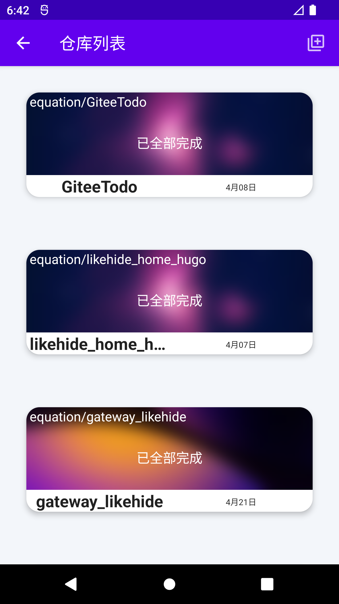
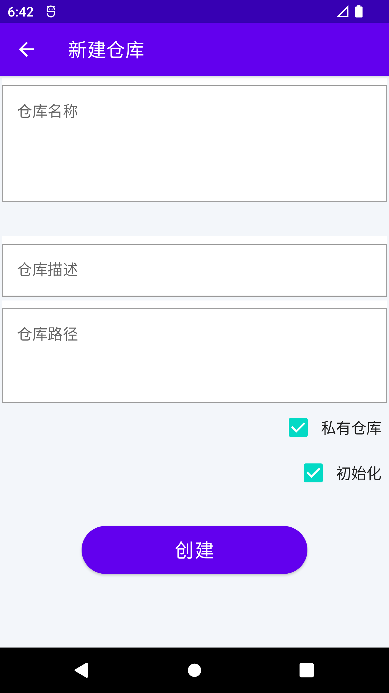
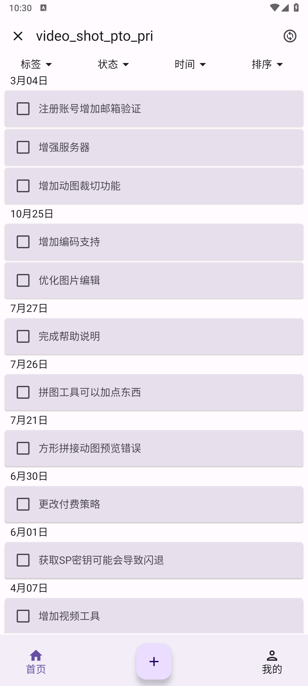
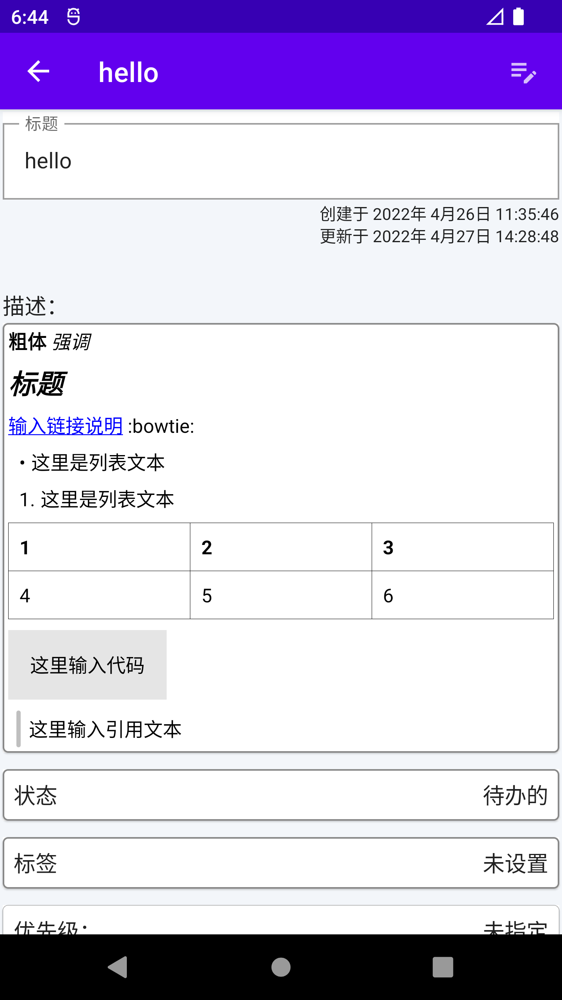
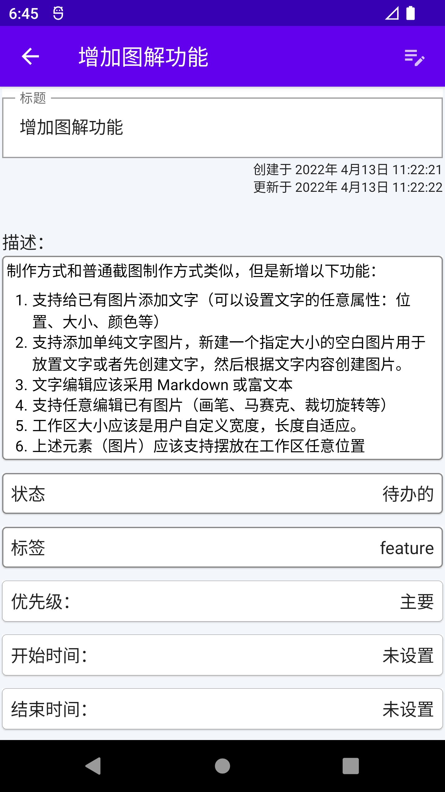
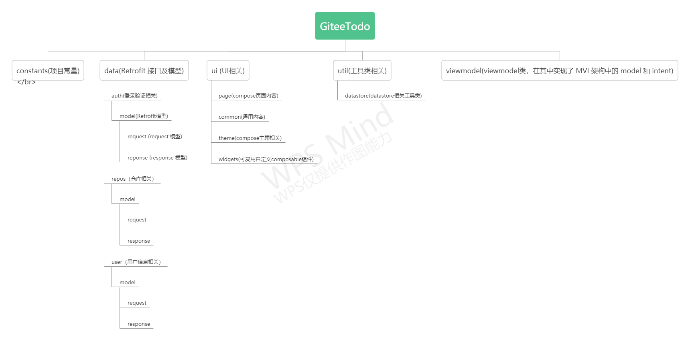

# GiteeTodo - 码云待办

## 简介
GiteeTodo 是一款基于 compose + viewmodel + Retrofit 实现的 MVI 架构 TODO 应用；使用 Gitee（码云）的 issue 作为储存仓库。

### 主要功能
- 查看仓库列表（仅获取类型为 *个人* ，且登录账号为 *创建者* 的仓库）
- 新建仓库
- 根据仓库查看 ISSUE 列表（支持筛选）
- 新建 ISSUE
- 快速标记 ISSUE 完成状态
- 查看某个 ISSUE 详情
- 编辑某个 ISSUE 详情
- 支持标签（label）管理
- 支持查看、新建、编辑、删除 ISSUE 评论
- 适配深色模式
- 支持桌面小部件

### 截图
|  |  |
| --------------------------------- | --------------------------------- |
|  |  |
|  |  |

### 项目结构图



### 使用的技术栈及第三方库
*基本架构： [MVI](https://juejin.cn/post/7048980213811642382)*

- viewmodel： ViewModel 类旨在以注重生命周期的方式存储和管理界面相关的数据。
- Hilt：Hilt 是一个适用于 Android 的依赖注入库，可减少在项目中进行手动依赖注入的样板代码。
- Navigation-Animation： 为 Navigation 提供动画支持的库。
- paging： 使用 Paging 库，您可以更轻松地在应用的 RecyclerView 中逐步妥善地加载数据。
- swiperefresh：一个提供实现滑动刷新布局的库，类似于 Android 的 SwipeRefreshLayout。
- placeholder：在加载内容时显示“占位符”的库。
- systemuicontroller：提供易于使用的实用程序，用于更新 Jetpack Compose 中的 System UI 栏颜色。
- retrofit2：网络请求库。
- datastore： 以异步、一致的事务方式存储数据，克服了 SharedPreferences 的一些缺点。
- coil：由 Kotlin Coroutines 支持的 Android 图像加载库。
- Pager：一个用于在 Jetpack Compose 中构建分页布局的库，类似于 ViewPager。
- compose-richtext： 用于在 compose 中显示富文本（包括 markdown）。
- lottie： 在 Android 、 iOS、 Web 和 React Native 上原生渲染 After Effects 动画。
- compose-material-dialogs： Jetpack Compose 的MD对话框。

### 下载
APK： *待补充*

国内源码镜像：[https://gitee.com/equation/GiteeTodo](https://gitee.com/equation/GiteeTodo)

## 使用方法

### 编译运行
首先你需要有自己的 client_id 和  client_secret。

请前往Gitee [注册](https://gitee.com/oauth/applications/new) 获取（详情请查阅 [创建应用流程](https://gitee.com/api/v5/oauth_doc#list-item-3)）。

注册信息请根据自己情况随意填写，但是**应用回调地址必须填写** `giteetodoapp://authed` 否则将无法登录。

然后在项目根目录下的 `local.properties` 文件中写入你创建的 id 和 密钥:
```
CLIENT_ID = "xxxxxx"
CLIENT_SECRET = "xxxxxx"
```

最后按照正常安卓程序的编译流程编译即可。

### 常规用法
由于本程序基于 Gitee 的 issue 系统，所以推荐的正确姿势是使用本应用来管理你的 Gitee 仓库 issue，方便随时新建、查看、修改 issue。

### 其他用法
还有一个比较 *“异端”* 的用法是将本程序作为一个纯粹的 TODO 程序，新建或使用你已有的 Gitee 仓库作为储存库，然后将你的 TODO 事项写入其中，一个完善的 TODO 应用应有的功能特性，本程序都有。 

## 如何登录
目前不提供离线使用，使用时必须联网，且为了保证正常使用，需要授权登录码云账户。

### 登录方式
本程序支持以下三种登录方式：

1. 账号密码登录
2. 私人令牌登录
3. OAuth2 授权登录
        
我们推荐使用第 2 或 第 3 种方式登录，不建议使用第 1 种方式登录。

#### 账号密码登录
直接使用码云账号密码登录，我们不会储存你的账号密码，该账号密码仅用于当前获取 token 这一过程，使用完毕会立即销毁。  

**我们不推荐使用该登录方式**

#### 私人令牌登录

登录码云（必须是桌面版）后，依次点击 右上角头像 - 设置 - 安全设置 - 私人令牌 - 生成新令牌 - 勾选所需要的权限（`user_info projects issues notes`） - 提交即可。
   
*使用私人令牌的优势： 不会暴露账号密码、权限可以自己控制、随时可以修改或删除授权。*

#### OAuth2 授权登录

使用码云官方 OAuth2 认证授权。
   
*使用 OAuth2 的优势：不会暴露账号密码、权限可以自己控制、随时可以修改或删除授权、token有效期只有一天。*

**注意**：无论使用什么方式登录，我们都会储存你的授权 Token ， 便于下次直接登录。

该 Token 你随时可以在 Gitee（码云）个人设置中查看并取消授权或删除、修改。

本程序绝对不会滥用用户授权的权限，仅使用本程序提到的功能，也不会读取或修改用户的其他任何信息。

如果不放心，欢迎查看源码或自行使用源码编译使用。

## 关于
由于我是第一次接触 MVI 架构，所以我也不确定这个程序是否符合 MVI 规范，如有错误，还望海涵并希望大佬们能不吝赐教。

我也是第一次接触 compose ，如有错误，还望大佬们能够指出。

该程序使用 API 来自于 Gitee 的 [OpenAPI](https://gitee.com/api/v5/swagger) 。

**请勿滥用 Gitee 资源。**

### 参考资料
该程序参照了 [shenzhen2017](https://github.com/shenzhen2017) 的 [wanandroid-compose](https://github.com/shenzhen2017/wanandroid-compose)

**MVI**

1. [Jetpack Compose 架构如何选？ MVP, MVVM, MVI](https://juejin.cn/post/6969382803112722446)
2. [MVVM 进阶版：MVI 架构了解一下~](https://juejin.cn/post/7022624191723601928)
3. [Google 推荐使用 MVI 架构？卷起来了~](https://juejin.cn/post/7048980213811642382)
4. [MVI架构模式？到底是谁在卷？《官方架构指南升级》](https://juejin.cn/post/7058903426893086734)
5. [一文了解MVI架构，学起来吧~](https://huanglinqing.blog.csdn.net/article/details/124273344)

**依赖注入**

1. [依赖注入库Hilt的使用和理解，一篇就够了](https://juejin.cn/post/6992500050790187021)
2. [Java：控制反转（IoC）与依赖注入（DI）](https://mp.weixin.qq.com/s/JaIJwuXnV0YCb1PwdXCMXg)
3. [Dependency injection with Hilt](https://developer.android.com/training/dependency-injection/hilt-android)
4. [Dagger-Hilt + Retrofit + Coroutines](https://rahul9650ray.medium.com/dagger-hilt-retrofit-coroutines-9e8af89500ab)

**数据分页**

1. [Large data-sets (paging)](https://developer.android.com/jetpack/compose/lists#large-datasets)
2. [Load and display paged data ](https://developer.android.com/topic/libraries/architecture/paging/v3-paged-data)

**glance**

1. [Jetpack Glance？小部件的春天来了](https://juejin.cn/post/7042468014251311112)
2. [Build Android App Widgets Using Jetpack Glance](https://betterprogramming.pub/android-jetpack-glance-for-app-widgets-bd7a704624ba)
3. [Announcing Jetpack Glance Alpha for app widgets](https://android-developers.googleblog.com/2021/12/announcing-jetpack-glance-alpha-for-app.html)

### 联系我
email: admin@likehide.com

website: [www.likehide.com](http://www.likehide.com)

其他APP：[app.likehide.com](http://app.likehide.com)