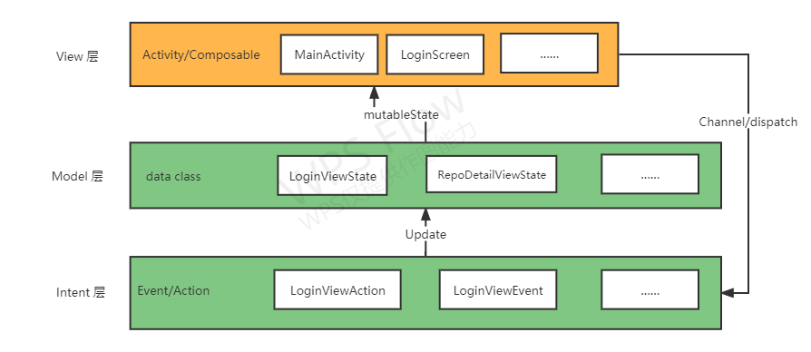

# GiteeTodo - 码云待办

## 简介
GiteeTodo 是一款基于 compose + viewmodel + Retrofit 实现的 MVI 架构 TODO 应用；基于 Gitee（码云）的 issue 作为储存仓库。

### 主要功能
- 查看仓库列表（仅获取类型为 *个人* ，且登录账号为 *创建者* 的仓库）
- 根据仓库查看 ISSUE 列表（支持筛选已完成和未完成）
- 快速标记 ISSUE 完成状态
- 查看某个 ISSUE 详情
- 编辑某个 ISSUE 详情

### 截图
待补充

### 项目结构图

### 使用的技术栈及第三方库
*基本架构： [MVI](https://juejin.cn/post/7048980213811642382)*

- viewmodel： ViewModel 类旨在以注重生命周期的方式存储和管理界面相关的数据。
- navigation： 构建和组织应用内界面，处理深层链接以及在屏幕之间导航。
- retrofit2：网络请求库。
- datastore： 以异步、一致的事务方式存储数据，克服了 SharedPreferences 的一些缺点。
- compose-richtext： 用于在 compose 中显示富文本（包括 markdown）。
- lottie： 动画库。

## 使用方法

### 常规用法
由于本程序基于 Gitee 的 issue 系统，所以推荐的正确姿势是使用本应用来管理你的 Gitee 仓库 issue，方便随时新建、查看、修改 issue。

### 其他用法
还有一个比较 *“异端”* 的用法是将本程序作为一个纯粹的 TODO 程序，新建或使用你已有的 Gitee 仓库作为储存库，然后将你的 TODO 事项写入其中，一个完善的 TODO 应用应有的功能特性，本程序都有。 

## 如何登录
目前不提供离线使用，使用时必须联网，且为了保证正常使用，需要授权登录码云账户。

### 登录方式
我们推荐使用第 2 或 第 3 种登录方式，非必要不推荐使用第 1 种方式。

本程序绝对不会滥用用户授权的权限，仅使用本程序提到的功能，也不会读取或修改用户的其他任何信息。

如果不放心，欢迎查看源码或自行使用源码编译使用。

1. 账号密码登录
直接使用码云账号密码登录，使用时会将你的账号密码加密后离线储存在你的设备上，我们不会将该账号密码明文储存也不会将该密码暴露在互联网中（除登录获取 Token 外）；储存账号密码是因为 Gitee 获取的 Token 有效期只有一天， Token 过期后必须重新获取。
   
**我们不推荐使用该登录方式**

2. 私人令牌登录
登录码云（必须是桌面版）后，依次点击 右上角头像 - 设置 - 安全设置 - 私人令牌 - 生成新令牌 - 勾选所需要的权限（`user_info projects issues notes`） - 提交即可。
   
使用私人令牌的优势： 不会暴露账号密码、权限可以自己控制、随时可以修改或删除授权。

3. OAuth2 授权登录
使用码云官方 OAuth2 认证授权。
   
使用 OAuth2 的优势：不会暴露账号密码、权限可以自己控制、随时可以修改或删除授权、token有效期只有一天。

## 关于
由于我是第一次接触 MVI 架构，所以我也不确定这个程序是否符合 MVI 规范，如有错误，还望海涵并希望大佬们能不吝赐教。

该程序使用 API 来自于 Gitee 的 [OpenAPI](https://gitee.com/api/v5/swagger) 。

**请勿滥用 Gitee 资源。**

该程序在撰写过程中参照了 [shenzhen2017](https://github.com/shenzhen2017) 的 [wanandroid-compose](https://github.com/shenzhen2017/wanandroid-compose)

### 联系我
email: admin@likehide.com

website: [www.likehide.com](http://www.likehide.com)

其他APP：[app.likehide.com](http://app.likehide.com)