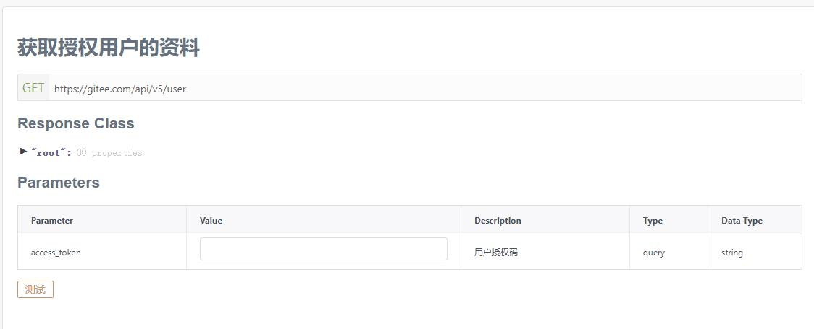

# 前言
现在声明式 UI 已逐渐成为主流，在客户端上，已有成熟的 Flutter 和 SwiftUi ，而原生安卓上的声明式 UI 却在去年年底才姗姗来迟。

虽然 compose 姗姗来迟，但是关于它的文章现在已经有很多了，这里就不再赘述，本文主要介绍如何使用 compose 实现一个 TODO 应用。

当然，既然要学习新的技术，那自然是不能只学习一个，索性就在这一个 APP 里面全部学习了吧。

因此该 APP 是基于 Gitee ISSUE 作为服务端，使用 MVI 框架，以 retrofit2 作为请求库，使用了依赖注入、数据分页，分页数据缓存数据库，支持 glance 桌面小部件的 TODO APP。

对了，虽然关于 compose 和 MVI，我最先发的文章是*使用 compose 基于 MVI 架构实现康威生命游戏* 但是事实上我真正用来入门上手 compose 和学习 MVI 架构的是本文所述的这个项目，因此这个项目可能会有很多不合理的地方，这也是我一直没有写这篇文章的原因。

好在经过生命游戏的练手，对 compose 的理解又上升了一点，之前一直不知道怎么解决的问题，现在又有了一些新的思路，所以我现在开始着手写这篇文章。

## 程序截图

|  |  |
| --------------------------------- | --------------------------------- |
|  |  |
|  |  |

**ps：这些截图都是很早之前的版本的了，现在 UI 改动挺大的，但是我也懒得重新截图了，有需要的去 Github 下载源码编译试试（狗头）**

**pps：对了，这个项目其实两个月前就写好了，只是一直没来得及发，哈哈，看我 Github 的提交记录就知道**


# 实现过程

## 整体结构
在开始之前先捋清楚需要实现什么功能，都有哪些页面。

由于是基于 Gitee 的 ISSUE 实现的，所以启动时肯定要先登录并且选择一个仓库后才能继续。

整体的页面结构如下：


我的想法是启动时无论是否已经登录都应该先进入登录页，然后在登录页进行判断，已登录则跳转至主页，未登录则展示登录页面。

## 实现 MVI 架构
在写这个 APP 时，架构方面参考了 [wanandroid-compose](https://github.com/shenzhen2017/wanandroid-compose) 的实现方法。

MVI 指的是 Model - View - Intent。

以登录页面为例：

### 定义 Model
在 MVI 中的 Model 指 UI 状态：

```kotlin
data class LoginViewState(
    val email: String = "", // 电子邮箱输入框内容
    val password: String = "", // 密码或密钥输入框内容
    val emailLabel: String = "邮箱", // 邮箱提示信息
    val passwordLabel: String = "密码", // 密码或密钥提示信息
    val accessLoginTitle: String = "私人令牌登录", // 密钥登录按钮文字
    val isPasswordVisibility: Boolean = false,  // 是否明文显示密码
    val isEmailError: Boolean = false,  // 邮箱是否输入错误
    val isPassWordError: Boolean = false, // 密码或密钥是否输入错误
    val isShowEmailEdit: Boolean = true,  // 是否显示邮箱输入框
    val isShowLoginHelpDialog: Boolean = false,  // 是否显示帮助 Dialog
    val isLogging: Boolean = true,  // 是否正在登录中（用于控制登录动画的显示）
)
```

各个字段的用途已在注释中标明，需要说明的是，因为 Gitee 访问 OpenApi 需要使用 token，而 token 有三种方式可以获得：

1. 直接生成
2. 通过账号密码获取
3. 通过 OAuth2 授权获取

所以我在设计这个应用时，把三种登录方式都涵盖到了其中，所以登录页面的 UI 信息变动会比较多，定义的状态相对应的也比较多。

### 定义 View
MVI 中的 View 和其他架构的 view 没有太大区别，在这里我们使用的是 compose 作为Ui，因为代码比较长，所以我截取其中的一部分：

```kotlin
@Composable
fun LoginContent() {
    val loginViewModel: LoginViewModel = viewModel()
    val viewState = loginViewModel.viewStates
    val context = LocalContext.current

    Column(Modifier.background(MaterialTheme.colors.baseBackground)) {

        Column(Modifier.weight(9f)) {
            Row(
                Modifier
                    .fillMaxWidth()
                    .padding(top = 100.dp),
                horizontalArrangement = Arrangement.Center) {

                Text(text = "登录", fontSize = 30.sp, fontWeight = FontWeight.Bold, letterSpacing = 10.sp)
            }

            if (viewState.isShowEmailEdit) {
                Row(
                    Modifier
                        .fillMaxWidth()
                        .padding(top = 8.dp),
                    horizontalArrangement = Arrangement.Center) {
                    EmailEditWidget(loginViewModel, viewState)
                }
            }

            Row(
                Modifier
                    .fillMaxWidth()
                    .padding(top = 8.dp),
                horizontalArrangement = Arrangement.Center) {
                PasswordEditWidget(loginViewModel, viewState)
            }

            Row(
                horizontalArrangement = Arrangement.End,
                modifier = Modifier
                    .fillMaxWidth()
                    .padding(start = 32.dp, end = 32.dp, top = 4.dp)) {
                LinkText("注册账号") {
                    loginViewModel.dispatch(LoginViewAction.Register(context = context))
                }
            }

            Row(
                Modifier
                    .fillMaxWidth()
                    .padding(top = 32.dp), horizontalArrangement = Arrangement.Center) {
                Button(
                    onClick =
                    {
                        loginViewModel.dispatch(LoginViewAction.Login)
                    },
                    shape = Shapes.large) {
                    Text(text = "登录", fontSize = 20.sp, modifier = Modifier.padding(start = 82.dp, end = 82.dp, top = 4.dp, bottom = 4.dp))
                }
            }
        }

        Column(Modifier.weight(1.5f)) {
            Row(
                Modifier
                    .fillMaxWidth()
                    .padding(top = 16.dp), verticalAlignment = Alignment.CenterVertically
            ) {
                Divider(
                    thickness = 2.dp,
                    modifier = Modifier
                        .padding(start = 8.dp)
                        .weight(1f)
                )
                Row(horizontalArrangement = Arrangement.Center,
                    verticalAlignment = Alignment.CenterVertically,
                    modifier = Modifier
                        .padding(start = 8.dp)
                        .weight(1f)) {
                    Text(text = "其他登录方式")
                    IconButton(onClick = { loginViewModel.dispatch(LoginViewAction.ShowLoginHelp) }) {
                        Icon(Icons.Outlined.HelpOutline, contentDescription = "疑问", tint = MaterialTheme.colors.primary)
                    }
                }
                Divider(
                    thickness = 2.dp,
                    modifier = Modifier
                        .padding(end = 8.dp, start = 8.dp)
                        .weight(1f)
                )
            }

            Row(
                Modifier
                    .fillMaxWidth()
                    .padding(32.dp, 0.dp), horizontalArrangement = Arrangement.SpaceBetween, verticalAlignment = Alignment.CenterVertically) {
                LinkText("OAuth2授权登录") {
                    loginViewModel.dispatch(LoginViewAction.SwitchToOAuth2)
                }
                LinkText(viewState.accessLoginTitle) {
                    loginViewModel.dispatch(LoginViewAction.SwitchToAccessToken)
                }
            }
        }
    }
}
```

从上述代码中，可以看到，通过 `viewModel()` 方法拿到了当前页面的 viewModel : `loginViewModel`， 再通过 `loginViewModel` 可以拿到当前页面的状态 `viewState`。

因为 MVI 强调数据的单向流动与状态的统一管理，所以当前页面的所有状态都写在了 `viewState` 中，而如果想要更改状态，不能直接修改 `viewState` 的属性，而应该通过 `loginViewModel.dispatch(LoginViewAction)` 来修改。

至于这个 `dispatch` 方法和 viewModel 的定义，我们接下来就会说。

### 定义 Intent
MVI 中的 Intent 非安卓中 Intent 而是泛指所有的用户操作。

在这里，我们定义一个 Action 用来表示用户操作：

```kotlin
sealed class LoginViewAction {
    // ......
    object Login : LoginViewAction()  // 登录
    data class UpdateEmail(val email: String) : LoginViewAction() // 更新邮箱输入框内容
    // ......
}
```
然后声明一个 `dispatch` 用来接受用户的操作：

```kotlin
    fun dispatch(action: LoginViewAction) {
        when (action) {
            // ......
            is LoginViewAction.Login -> login()
            is LoginViewAction.UpdateEmail -> updateEmail(action.email)
            // ......
        }
    }
```

在接受到请求后，进行相应的逻辑处理或者更改状态，例如 `login` 方法：

```kotlin
private fun login() {
    // ......
    // 检查输入内容
    if (viewStates.email.isBlank()) {
        // 更新邮箱提示信息状态
        viewStates = viewStates.copy(isEmailError = true, emailLabel = "请输入邮箱")
        return
    }
    // ......
    
    // 更改为正在登录状态
    viewStates = viewStates.copy(isLogging = true)

    // 启动协程
    viewModelScope.launch {
        // 开始发送请求
        val response = oAuthApi.getTokenByPsw(
            viewStates.email,
            viewStates.password,
            ClientInfo.ClientId,
            ClientInfo.ClientSecret)

        // 对请求返回数据进行处理
        // ......
    }
}
```

自此，MVI 的基本架构就构建完成了，剩下的页面根据需求照葫芦画瓢依次写出来就完事了。

## 使用 retrofit2 实现网络请求
作为一个完全在线版的 TODO APP，网路请求是必不可少的，由于 Gitee 的 OpenApi 是基本参照 Github 的 OpenApi 编写的，所以它的所有接口都是 *restful* 的，对于这种接口，用 retrofit2 在适合不过了。

### 定义请求接口

使用 retrofit2 前我们需要先定义一个接口，用于后续的请求，这里以 `UserApi` 为例：

接口参数如下：



接口定义如下：

```kotlin
interface UserApi {

    /**
     * 获取用户信息
     * */
    @GET("user/")
    suspend fun getUser(@Query("access_token") accessToken: String): Response<User>
}
```

我们定义了一个名为 `UserApi` 的接口，用于处理所有与用户信息相关的请求，当然，这里我们只需要一个接口，就是 `getUser` 用于获取用户信息。

新版 retrofit2 已经支持了 kotlin 的协程，因此此处我们使用了挂起函数 `suspend fun getUser` 。

对该方法使用 `@GET("user/")` 标明是 GET 请求，并且请求路径为 `user/` ，最后在方法参数中添加 `@Query("access_token")` 注解，标明需要构造的请求参数。

### 构造 RetrofitManger

定义好 API 接口后我们需要编写一个 RetrofitManger 单例类，用于构建并获取定义好的 API 接口：

```kotlin
object RetrofitManger {
    
    // ......
    private var userApi: UserApi? = null

    private const val CONNECTION_TIME_OUT = 10L
    private const val READ_TIME_OUT = 10L
    

    var BaseUrl = "https://gitee.com/api/v5/"
    
    // ......

    fun getUserApi(): UserApi {
        if (userApi == null) {
            synchronized(this) {
                if (userApi == null) {
                    val okHttpClient =
                        buildOkHttpClient()
                    userApi =
                        buildRetrofit(
                            BaseUrl,
                            okHttpClient
                        ).create(UserApi::class.java)
                }
            }
        }
        return userApi!!
    }
    
    // ......

    private fun buildOkHttpClient(): OkHttpClient.Builder {
        val logging = HttpLoggingInterceptor()
        logging.level = HttpLoggingInterceptor.Level.BODY
        return OkHttpClient.Builder()
            .addInterceptor(logging)
            .connectTimeout(CONNECTION_TIME_OUT, TimeUnit.SECONDS)
            .readTimeout(READ_TIME_OUT, TimeUnit.SECONDS)
            .proxy(Proxy.NO_PROXY)
    }

    private fun buildRetrofit(baseUrl: String, builder: OkHttpClient.Builder): Retrofit {
        val client = builder.build()

        return Retrofit.Builder()
            .baseUrl(baseUrl)
            .addConverterFactory(GsonConverterFactory.create())
            .client(client).build()
    }
}
```

上述代码构造了 Retrofit 对象，并设置好相应参数，最后传入 `UserApi` 接口，自此我们的 `UserApi` 已构造完成。

需要使用时只需要 `val userApi = RetrofitManger.getUserApi() ` 然后 `userApi.getUser()` 即可完成请求。


## 使用依赖注入
依赖注入是实现控制反转的一种方式，通过控制反转可以将不同类之间的强耦合关系解耦。

强耦合的缺陷自不必多说，不方便修改，不方便测试。

我在接手公司的某项目时就遇到了强耦合的坑，因为某个老项目开发时写的比较随意，原代码各种强耦合各种嵌套依赖。

后来有个需求，让我给这个项目加上单元测试，差点没把我累死，几乎每加一个测试就得把要测试的地方重构一遍以解耦，不然压根没法写测试用例。

扯远了，我们来说一下在这个项目中如何实现依赖注入，以及哪些地方需要使用依赖注入。

在依赖注入框架上我们选择的是 `Hilt` 。

### 需要依赖注入的地方
在本 项目 中，使用了 retrofit2 作为网络请求库，所以首当其冲的，需要在使用 retrofit2 的地方用依赖注入，避免强耦合。

其次，由于 MVI 框架的特性，项目中有大量的 xxViewModel ，这同样是需要注入的类。

最后，在数据分页时我使用了 room 实现数据缓存，这同样是需要注入的地方。

### 注入 retrofit2 API
在 `LoginViewModel` 中，我们需要使用两个 retrofit2 API ：`OAuthApi` 和 `UserApi` 分别用于验证和获取用户信息：

```kotlin
class LoginViewModel() : ViewModel() {
    // ......
    private val oAuthApi: OAuthApi = RetrofitManger.getOAuthApi()
    private val userApi: UserApi = RetrofitManger.getUserApi()
    
    // ......
}
```

这里我们需要将其改成 `LoginViewModel` 的参数，并且使用依赖注入，降低 viewModel 对 Retrofit 的耦合。

#### 创建Hilt模块

Hilt 模块可以告知 Hilt 在需要某些实例时使用哪种实现，例如这里我们给 `userApi` 定义一个 `Provides` 指定如何实现 `userApi` ：

```kotlin
@Module
@InstallIn(SingletonComponent::class)
object NetworkModule {

    @Singleton
    @Provides
    fun provideOkHttpClient() = run {
        val logging = HttpLoggingInterceptor()
        logging.level = if (BuildConfig.DEBUG) HttpLoggingInterceptor.Level.BODY else HttpLoggingInterceptor.Level.BASIC
        OkHttpClient.Builder()
            .addInterceptor(logging)
            .connectTimeout(Net.CONNECTION_TIME_OUT, TimeUnit.SECONDS)
            .readTimeout(Net.READ_TIME_OUT, TimeUnit.SECONDS)
            .proxy(Proxy.NO_PROXY)
            .build()
    }

    @Singleton
    @Provides
    fun provideRetrofit(okHttpClient: OkHttpClient): Retrofit = Retrofit.Builder()
        .addConverterFactory(GsonConverterFactory.create())
        .baseUrl(Net.BASE_URL)
        .client(okHttpClient)
        .build()
    
    // ......

    @Singleton
    @Provides
    fun provideUserApiService(retrofit: Retrofit): UserApi = retrofit.create(UserApi::class.java)
    
    // ......
    
}
```

在上述代码中，我们定义了一个 `provideUserApiService` 并使用 `@Provides` 注解绑定 `UserApi` 的实例注入方法。

在 `provideUserApiService` 中通过 `retrofit.create(UserApi::class.java)` 构建 `UserApi` ，与上面直接使用 `RetrofitManger` 构建一样，不同的是，这里的 `retrofit` 也来自依赖注入。

而它的定义就在上面 `provideRetrofit` ，`provideRetrofit` 又依赖了 `okHttpClient`，哈哈，没错，这就是个套娃，虽然有点绕，但是稍微捋一捋就明白了。

#### 让 LoginViewModel 使用注入
定义好 `userApi` 的注入方法后，下一步就是让 `LoginViewModel` 使用这个依赖，更改 `LoginViewModel` 类定义为：

```kotlin
class LoginViewModel @Inject constructor(
    private val oAuthApi: OAuthApi,
    private val userApi: UserApi
) : ViewModel() { 
    // ......
}
```

在构造方法前加上 `@Inject` 注解表示该类中的构造参数使用依赖注入。加上这个注解后，Hilt 会自动将 `oAuthApi` 和 `userApi` 按照我们定义的实例化方法构造出来然后注入到这里。

如此一来，我们在需要用到 `LoginViewModel` 的地方，直接实例化即可，不需要填入它的参数，它的两个参数会被 Hilt 自动注入：

```kotlin
val loginViewModel: LoginViewModel = LoginViewModel()
```

### 注入 xxViewModel
为了方便使用，我们连 viewModel 都不想在自己实例化，能不能自动注入呢？

答案当然是可以，我们只需要在类定义时加上 `@HiltViewModel` 注解即可：

```kotlin
@HiltViewModel
class LoginViewModel @Inject constructor(
    private val oAuthApi: OAuthApi,
    private val userApi: UserApi
) : ViewModel() {
    // ......
}
```

这样其他类在使用 viewModel 时就可以直接使用注入的依赖，例如：

```kotlin
@Composable
fun LoginScreen(
    navController: NavHostController,
    viewModel: LoginViewModel = hiltViewModel()
) { 
    // ......
}
```
调用 `LoginScreen` 时，无需填写 `viewModel` 参数，这个参数会被 Hilt 自动注入。

### 其他类的注入
其他类和上述两个类情况基本差不多，这里就不过多赘述了。

## 数据分页与缓存
由于 TODO 列表的 item 理论上来说可以是无限多的，如果不适用分页加载那么必定会造成加载时缓慢甚至卡顿。所以我在 TOOD 列表页获取数据时使用到了 paging 库做分页处理，同时为了增加用户体验，我还使用了 room 做缓存。

### 定义 ROOM
正如上文所说，由于使用到了 room 做数据缓存，所以必须创建 room 需要的各种类。

首先定义数据库的实体类：

```kotlin
@Entity(tableName = "issues_show_data")
data class TodoShowData(
    @PrimaryKey
    val id: Int,
    val title: String,
    val number: String,
    val state: IssueState,
    val updateAt: String,
    val createdAt: String,
    val labels: List<Label>,
    val headerTitle: String
)
```

然后定义 Dao ，对于给分页库使用的 Dao，除了常规的方法外，还必须实现 `insertAll()` 用于将数据插入数据库； `clearAll()` 删除所有数据：

```kotlin
@Dao
interface IssueDao {
    @Insert(onConflict = OnConflictStrategy.REPLACE)
    suspend fun insertAll(users: List<TodoShowData>)

    @Query("SELECT * FROM issues_show_data ORDER BY updateAt ASC")
    fun pagingSourceOrderByAsc(): PagingSource<Int, TodoShowData>

    @Query("SELECT * FROM issues_show_data ORDER BY updateAt DESC")
    fun pagingSourceOrderByDesc(): PagingSource<Int, TodoShowData>

    @Query("DELETE FROM issues_show_data")
    suspend fun clearAll()
}
```

注意， 因为这是给分页库使用的数据，所以Dao 返回的数据类型是 `PagingSource` 。

### 定义 RemoteMediator
RemoteMediator 用来实现当前数据已经用尽或者数据失效时从服务器请求新的数据。

#### 构造参数

一般来说，典型的 RemoteMediator 类构造参数应该有三个：

1. query: 用于定义查询参数
2. database： 用于缓存的数据库
3. networkService： 请求实例

基于我们的需求，我们将 RemoteMediator 定义如下：

```kotlin
class IssueRemoteMediator(
    private val queryParameter: QueryParameter,
    private val database: IssueDb,
    private val repoApi: RepoApi
) : RemoteMediator<Int, TodoShowData>() {
    // ......
}
```

其中 `queryParameter` 是我自定义的一个查询参数数据类：

```kotlin
data class QueryParameter(
    val repoPath: String = "null/null",
    val state: String? = null,
    val accessToken: String = "",
    val labels: String? = null,
    val direction: String = "desc",
    val createdAt: String? = null
)
```

`database` 即 room 数据库操作实例类(RoomDatabase)，通过 `create` 方法创建得到：

```kotlin
@Database(
    entities = [TodoShowData::class, IssueRemoteKey::class],
    version = 1,
    exportSchema = false
)
@TypeConverters(IssueConverters::class)
abstract class IssueDb : RoomDatabase() {
    companion object {
        fun create(context: Context, useInMemory: Boolean = false): IssueDb {
            val databaseBuilder = if (useInMemory) {
                Room.inMemoryDatabaseBuilder(context, IssueDb::class.java)
            } else {
                Room.databaseBuilder(context, IssueDb::class.java, "issue_show_data.db")
            }
            return databaseBuilder
                .fallbackToDestructiveMigration()
                .build()
        }
    }

    abstract fun issue(): IssueDao
    abstract fun issueRemoteKey(): IssueRemoteKeyDao
}
```

`repoApi` 即 retrofit2 API。

而继承的 `RemoteMediator` 的两个泛型，分别表示 key 和 value 的类型，这里我的 key 是 Int 类型，value 是上面定义的 TodoShowData 类型。

#### load()
我们需要在 RemoteMediator 中重写 `load` 方法来定义加载行为，`load` 方法有两个参数：

1. LoadType，表示负载的类型： REFRESH、 APPEND 或 PREPEND。
2. PagingState，其中包含到目前为止加载的页面、最近访问的索引以及 PagingConfig 用于初始化分页流的对象信息。

具体代码如下：

```kotlin
override suspend fun load(loadType: LoadType, state: PagingState<Int, TodoShowData>): MediatorResult {
    return try {
        val nextPage = when (loadType) {
            /*
            * 如果当前状态为刷新的话则将加载页面设置为 1，也就是从头开始加载
            * */
            LoadType.REFRESH -> {
                1
            }
            /*
            * 这个表示向上滑动，这里不需要处理向上滑动，所以直接返回完成
            * */
            LoadType.PREPEND -> {
                return MediatorResult.Success(endOfPaginationReached = true)
            }
            /*
            * 如果loadType是APPEND，那么我们将在列表中查找最后一项，并查看NewsRemoteKeys数据指定的下一页。
            * 使用函数getRemoteKeyForLastItem()我们可以获得最后一个NewsRemoteKeys ，
            * 这样我们就可以从它的nextKey值中获得适当的下一页编号。
            * 如果没有这样的对象，这意味着我们到达了分页的末尾，
            * 在这种情况下，我们将返回MediatorResult.Success并带有endOfPaginationReached = true 。
            * */
            LoadType.APPEND -> {
                val remoteKeys = getRemoteKeyForLastItem(state)
                    ?: throw InvalidObjectException("Result is empty")
                remoteKeys.nextKey ?: return MediatorResult.Success(true)
            }
        }

        val repoPath = queryParameter.repoPath

        if (repoPath == "null/null") {
            return MediatorResult.Error(IllegalArgumentException("路径为空！"))
        }
        val response = repoApi.getAllIssues(
            repoPath.split("/")[0],
            repoPath.split("/")[1],
            queryParameter.accessToken,
            labels = queryParameter.labels,
            state = queryParameter.state,
            direction = queryParameter.direction,
            createdAt = queryParameter.createdAt,
            page = nextPage,
            perPage = when (loadType) {
                LoadType.REFRESH -> state.config.initialLoadSize
                else -> state.config.pageSize
            }
        )

        if (!response.isSuccessful) {
            throw HttpException(response)
        }

        val issueList = response.body() ?: emptyList()

        /*
        * 将从服务器获取到的数据重新解析
        *
        * 此步的目的：
        *   1. 服务器返回数据有上百个字段，而且每个字段都互相嵌套，如果都存进数据库不好理清各个字段之间的关系
        *   2. 本地实际使用到的字段不足十个，其他全是冗余字段，即使保存了也不会使用，不如索性不保存了
        * */
        val resultData = resolveIssue(response) // 该方法就是对返回的数据重新解析封装成 TodoShowData

        val totalPage = (response.headers()["total_page"] ?: "-1").toIntOrNull() ?: -1

        // 此处是将解析好的数据缓存进数据库
        database.withTransaction {
            if (loadType == LoadType.REFRESH) { // 如果刷新的话则先清除所有本地数据
                issueKeyDao.clearAll()
                issueDao.clearAll()
            }

            val prevKey = if (nextPage == 1) null else nextPage - 1
            val nextKey = if (nextPage >= totalPage || totalPage == -1) null else nextPage + 1
            val keys = issueList.map {
                IssueRemoteKey(issueId = it.id, prevKey = prevKey, nextKey = nextKey)
            }
            issueKeyDao.insertAll(keys)
            issueDao.insertAll(resultData)
        }

        // 返回加载成功，其中的参数标记是否为最后一页
        MediatorResult.Success(
            endOfPaginationReached = nextPage >= totalPage || totalPage == -1
        )
    } catch (tr: Throwable) {
        Log.w(TAG, "load: load data fail", tr)
        MediatorResult.Error(tr)
    }
}
```

上面这段代码是干嘛的我已经在注释中说明。

有一点值得注意的是，因为分页库不支持使用简单的页码标记分页项，而是只支持使用 key 标记加载位置，然后下次加载时从 key 位置继续加载。

不巧的是 Gitee 的 OpenApi 不支持使用 key 分页，只支持使用页码分页，所以我们需要额外增加一个数据库，用于绑定 key 和页码的关系，具体实现思路和方法可以看 [Android Paging 3 library with page and limit parameters](https://www.bornfight.com/blog/android-paging-3-library-with-page-and-limit-parameters/) ，我就不过多赘述了。

#### 使用数据
到目前为止，使用分页库的前期准备工作已完成，下一步就是在 viewModel 中使用这些数据，并且更新到 UI 中。

在 viewModel 中添加这样一个状态：

```kotlin
private val queryFlow = MutableStateFlow(QueryParameter())

@OptIn(ExperimentalCoroutinesApi::class, ExperimentalPagingApi::class)
private val issueData = queryFlow.flatMapLatest {
    Pager(
        config = PagingConfig(pageSize = 50, initialLoadSize = 50),
        remoteMediator = IssueRemoteMediator(it, dataBase, repoApi)
    ) {
        if (it.direction == Direction.ASC.des) {
            dataBase.issue().pagingSourceOrderByAsc()
        }
        else {
            dataBase.issue().pagingSourceOrderByDesc()
        }
    }
        .flow
        .cachedIn(viewModelScope)
}
```

因为我需要在 `QueryParameter` 更改时重新请求，所以这里用 Flow 包装了一下，并且在请求参数变化时重新请求数据，一般在使用不用这么麻烦，去掉 Flow 相关的地方就行。

我在这里为 `Pager` 方法设置了两个参数：

1. config ： 用于配置 分页的一些参数，比如这里我设置一页的数目和初始化加载时数目都为 50
2. remoteMediator：即我们上面定义的 `IssueRemoteMediator`

上面代码中的 `issueData` 即最终用于获取数据的 Flow。

然后，我们需要在 UI 中调用 `issueData` 的 `collectAsLazyPagingItems()` 获取到 `LazyPagingItems`。

通过该 `LazyPagingItems` 就可以拿到加载状态和最终加载出来的数据：

```kotlin
// ......
val todoPagingItems = viewState.issueData.collectAsLazyPagingItems() // 获取 LazyPagingItems
// ......
if (todoPagingItems.itemCount < 1) { // 获取当前 item 数量
    if (todoPagingItems.loadState.refresh == LoadState.Loading) { // 获取当前加载状态
        LoadDataContent("正在加载中…")
    }
    // ......
    else {
        // ......
        ListEmptyContent("还没有数据哦，点击立即刷新", "TIPS： 点击下方 “+” 可以添加你的第一条数据哦\n也可以尝试更换仓库或筛选条件再试试") {
            todoPagingItems.refresh() // 主动刷新数据
        }
    }
}
// ......
todoPagingItems.itemSnapshotList.forEach { item: TodoShowData? -> // 获取并遍历当前加载的所有数据
    // ...... ShowItem(item) ....
}
```

自此分页和缓存就全部完成了。

## 使用 glance 实现用 compose 写桌面小部件
既然决定了要完全使用 compose 实现这个APP，自然小部件也得用 compose 来做了，所幸谷歌提供了一个叫做 glance 的库，用于支持 compose 撰写小部件。

关于怎么写小部件以及一些前期配置，我这里就不再过多赘述，感兴趣的可以自行查看文档，现在我就说一下使用 compose 和直接使用 view 有什么区别。

### UI 界面
首先，Receiver 需要继承自 `GlanceAppWidgetReceiver` 而非 `AppWidgetProvider` ，并且重写 `glanceAppWidget` 属性：

```kotlin
class TodoListWidgetReceiver : GlanceAppWidgetReceiver() {
    // ......
    override val glanceAppWidget: GlanceAppWidget = TodoListWidget()
    // ......
}
```

这个 `glanceAppWidget` 即小部件显示的 UI，在这里我们定义了一个继承自 `GlanceAppWidget` 的 `TodoListWidget`：

```kotlin
class TodoListWidget : GlanceAppWidget() {
    @Composable
    override fun Content() {
        val prefs = currentState<Preferences>()
        val todoList = prefs[TodoListWidgetReceiver.TodoListKey]
        val loadStatus = prefs[TodoListWidgetReceiver.LoadStateKey]


        TodoListWidgetContent(todoList, loadStatus)
    }
}
```

接下来 UI 的写法就和普通 compose 别无二致了，所以我也不再多说，只是有几点需要注意一下。

使用 Glance 的时候，注意导包不要导错，Glance 使用的是 `androidx.glance.xxx` 包，而非一般 compose 的 `androidx.compose.xxx`。

还有，在 Glance 中，`Modifier` 叫 `GlanceModifier` 。

### 交互
接下来我们看看怎么实现和小部件的交互。

glance 中小部件和用户交互支持：
1. 启动 Activity
2. 执行回调
3. 启动 Service
4. 启动广播

其他都很简单，这里我们说一下如何执行回调

在我们的小部件中，和用户交互的有个地方是点击刷新按钮后刷新数据。

刷新按钮 的 composable 是这样写的：

```kotlin
Row(modifier = GlanceModifier.fillMaxWidth().clickable(actionRunCallback<TodoListWidgetCallback>(refreshActionPar))) {
    // ......
    Row(modifier = GlanceModifier.fillMaxWidth(), horizontalAlignment = Alignment.End) {
        Text(text = "刷新",
            style = TextStyle(color = ColorProvider(MaterialTheme.colors.primary)))
    }
    // ......
}
```

可以看到，在 `clickable` 中我们用 `actionRunCallback<TodoListWidgetCallback>(refreshActionPar))` 执行了 `TodoListWidgetCallback` 并且附加了 `refreshActionPar` 参数。

其中，`refreshActionPar` 参数定义如下：

```kotlin
const val ACTION_NAME = "actionName"

val actionKey = ActionParameters.Key<String>(ACTION_NAME)
val refreshActionPar = actionParametersOf(actionKey to TodoListWidgetCallback.UPDATE_ACTION)
```

`TodoListWidgetCallback` 定义如下：

```kotlin
// 其实可以不用 callback 来中转，
// 可以直接使用 actionSendBroadcast 发送广播的，
// 但是这里为了方便以后扩展，所以还是统一都使用 callback 转一下
class TodoListWidgetCallback : ActionCallback {
    override suspend fun onRun(context: Context, glanceId: GlanceId, parameters: ActionParameters) {
        val actionKey = ActionParameters.Key<String>(ACTION_NAME)
        val actionName = parameters[actionKey]

        if (actionName == UPDATE_ACTION) {
            val intent = Intent(context, TodoListWidgetReceiver::class.java).apply {
                action = UPDATE_ACTION
            }
            context.sendBroadcast(intent)
        }
    }

    companion object {
        const val ACTION_NAME = "actionName"
        const val UPDATE_ACTION = "updateAction"
    }
}
```

从上面代码和注释可知，虽然这里用了回调，但是最终还是通过发送广播来刷新的，理由正如注释所说。

在 `TodoListWidgetReceiver` 中重写 `onReceive` 并处理刷新逻辑:

```kotlin
override fun onReceive(context: Context, intent: Intent) {
    super.onReceive(context, intent)

    // ......
    
    if (intent.action == TodoListWidgetCallback.UPDATE_ACTION) {
        coroutineScope.launch {

            // ..........
            
            val todoListResponse = xxxx  // 重新请求数据

            // 所有 widget 都更新成同一个内容
            val glanceIdList = GlanceAppWidgetManager(context).getGlanceIds(TodoListWidget::class.java) // 获取当前小部件列表
            for (glanceId in glanceIdList) {  // 遍历小部件
                glanceId.let {
                    // 更新小部件参数
                    updateAppWidgetState(context, PreferencesGlanceStateDefinition, it) { pref ->
                        pref.toMutablePreferences().apply {
                            this[TodoListKey] = todoTitleList.toJson()
                            this[LoadStateKey] = loadState
                        }
                    }
                    glanceAppWidget.update(context, it)
                }
            }
        }
    }
    
    // ......
}
```

刷新时，按照正常处理逻辑，应该是仅刷新用户点击了刷新按钮的小部件（因为同一个小部件理论上可以添加无数个），但是这里为了方便理解，直接写成了遍历刷新所有小部件。

# 总结

其实我还用到了很多没有在文中提及到的技术或者库，也还有很多东西没有在文中说到，不过这些都可以在源码中找到：

仓库地址：[GiteeTodo](https://github.com/equationl/GiteeTodo)

欢迎 star~

这个项目写了我好几个月，但是因为是第一次写 compose 项目，所以还是有很多问题。

比如，在主页我实现了一个炫酷的滑动列表自动进入沉浸式全屏的动画，但是这个动画经常会鬼畜，我找了好久的原因都没找到，现在想想应该是因为监听列表状态和动画冲突了，应该在动画进行时禁用列表状态监听就好了。

又比如，使用导航库时，可能会出现错误的出栈，比如登录后选择了仓库，此时按返回键应该触发退出程序，但是现在可能会退回到登录界面。

无论如何，目前这个项目还有很多不完善的地方，但是我会对他进行持续性的更新，同时也欢迎各位大佬提出意见或建议，如果能提交 PR 修复或添加特性那更是感激不尽！